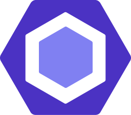

<a href="https://github.com/pulls?q=author%3Asxzz">
  <picture>
    <source media="(prefers-color-scheme: dark)" srcset="https://github-stats.liuli.lol/api?username=sxzz&theme=vue-dark&show_icons=true&include_all_commits=true&count_private=true">
    
  </picture>
</a>

### 👋 Hi there, I'm 三咲智子. (Kevin Deng)

- 🧑‍🎓 Student
- 🧑🏻‍💻 Freelancer
-  [@vuejs](https://github.com/vuejs)
-  [@vueuse](https://github.com/vueuse)
-  [@elk-zone](https://github.com/elk-zone)

<!--  -->

#### ☎️ Find me

-  [Email](mailto:hi@sxzz.moe)
-  [Twitter](https://twitter.com/sanxiaozhizi)
-  [Blog](https://blog.sxzz.moe/)

#### 💖 Sponsor 赞助

If my code has helped you, please consider [sponsoring me](https://github.com/sponsors/sxzz).

-  [GitHub Sponsor](https://github.com/sponsors/sxzz)
  - [For Chinese guide 中国大陆用户指南](https://github.com/sxzz/sponsors/blob/main/doc/chinese-guide.md)
-  Ethereum, Polygon: [sanxiaozhizi.eth](https://etherscan.io/address/0x86930e4c4ef9d62d44e3363e4d23e759bcdeeaa0)

#### ⚙️ Projects

 

👀 More Projects

| Package                                                                                | Badges                                                                                                                                      |
| -------------------------------------------------------------------------------------- | ------------------------------------------------------------------------------------------------------------------------------------------- |
| [element-plus](https://github.com/element-plus/element-plus)                           |                                  |
| [@element-plus/icons-vue](https://github.com/element-plus/element-plus-icons)          |            |
| [unplugin-element-plus](https://github.com/element-plus/unplugin-element-plus)         |                |
| [element-plus-playground](https://github.com/element-plus/element-plus-playground)     |          |
| [element-plus-issue-helper](https://github.com/element-plus/element-plus-issue-helper) |  |
| [@sxzz/eslint-config](https://github.com/sxzz/eslint-config)                           |                    |
| [vue-functional-ref](https://github.com/sxzz/vue-functional-ref)                       |                      |
| [unplugin-vue](https://github.com/sxzz/unplugin-vue)                                   |                                  |
| [unplugin-vue-macros](https://github.com/sxzz/unplugin-vue-macros)                     |                    |
| [unplugin-jsx-string](https://github.com/sxzz/unplugin-jsx-string)                     |                    |
| [unplugin-ast](https://github.com/sxzz/unplugin-ast)                                   |                                  |
| [unplugin-combine](https://github.com/sxzz/unplugin-combine)                           |                          |
| [unplugin-glob](https://github.com/sxzz/unplugin-glob)                                 |                                |
| [unplugin-vue-jsx](https://github.com/sxzz/unplugin-vue-jsx)                           |                          |
| [ast-walker-scope](https://github.com/sxzz/ast-walker-scope)                           |                          |
| [esbuild-plugin-transform](https://github.com/sxzz/esbuild-plugin-transform)           |          |
| [jike-sdk](https://github.com/open-jike/jike-sdk)                                      |                                          |
| [jike-cli](https://github.com/open-jike/jike-cli)                                      |                                          |
| [dayjs](https://github.com/iamkun/dayjs/tree/next) 2 (WIP)                             |                                          |
| [normalize-wheel-es](https://github.com/sxzz/normalize-wheel-es)                       |                      |

##### Apps / CLI

| Package                                                          | Description                                          |                                                                                                               |
| ---------------------------------------------------------------- | ---------------------------------------------------- | ------------------------------------------------------------------------------------------------------------- |
| [vue-jsx-playground](https://github.com/sxzz/vue-jsx-playground) | A playground for Vue JSX.                            | [Website](https://vue-jsx.sxzz.moe/)                                                                          |
| [@sxzz/create](https://github.com/sxzz/create)                   | Command-line for creating projects from templates.   |    |
| [free-hls-live](https://github.com/sxzz/free-hls-live)           | Free live streaming with Free-HLS. (Free HLS 直播姬) |  |
| [kg-downloader](https://github.com/sxzz/kg-downloader)           | 全民 K 歌下载器                                      |  |

##### Templates

| Repo                                                                               | Description                          |
| ---------------------------------------------------------------------------------- | ------------------------------------ |
| [element-plus-best-practices](https://github.com/sxzz/element-plus-best-practices) | Element Plus Best Practices 最佳实践 |
| [node-lib-starter](https://github.com/sxzz/node-lib-starter)                       | My minimal Node.js library starter.  |
| [unplugin-starter](https://github.com/sxzz/unplugin-starter)                       | Starter template for unplugin.       |

##### Maintaining

- [vuejs/core](https://github.com/vuejs/core) - Vue.js is a progressive, incrementally-adoptable JavaScript framework for building UI on the web.
- [vueuse/vueuse](https://github.com/vueuse/vueuse) - Collection of essential Vue Composition Utilities for Vue 2 and 3.
- [elk-zone/\*](https://github.com/elk-zone) - A nimble Mastodon web client.
- [unplugin-vue-components](https://github.com/antfu/unplugin-vue-components) - On-demand components auto importing for Vue.
- [unplugin](https://github.com/unjs/unplugin) - Unified plugin system for Vite, Rollup, Webpack, and more.

📦 No Longer Maintained

- [element-plus](https://github.com/element-plus/element-plus) - A Vue.js 3 UI Library.
- [element-plus-icons](https://github.com/element-plus/element-plus-icons) - Element Plus icon resources and Vue components.
- [element-plus-playground](https://github.com/element-plus/element-plus-playground) - A playground for Element Plus. Code online and preview.
- [element-plus-issue-helper](https://github.com/element-plus/element-plus-issue-helper) - Issue helper for Element Plus.
- [unplugin-element-plus](https://github.com/element-plus/unplugin-element-plus) - Import Element Plus on demand. Support Vite, Webpack, Vue CLI, Rollup and esbuild.

##### Personal

- [unplugin-vue](https://github.com/sxzz/unplugin-vue) - Transform Vue 3 SFC to JavaScript. Supports Vite, Webpack, Vue CLI, Rollup, esbuild and more.
- [vue-functional-ref](https://github.com/sxzz/vue-functional-ref) - Functional-style refs for Vue.
- [unplugin-vue-macros](https://github.com/sxzz/unplugin-vue-macros) - Extend macros and syntax in Vue.
- [unplugin-jsx-string](https://github.com/sxzz/unplugin-jsx-string) - Converts JSX to HTML strings at compile time.
- [unplugin-ast](https://github.com/sxzz/unplugin-ast) - Manipulate the AST to transform your code.
- [esbuild-plugin-transform](https://github.com/sxzz/esbuild-plugin-transform) - Pipe transformation plugins for esbuild.
- [ast-walker-scope](https://github.com/sxzz/ast-walker-scope) - Traverse Babel AST with scope information.
- [My ESLint config](https://github.com/sxzz/eslint-config) -  ESLint config for JavaScript, TypeScript, Vue 2, Vue 3, Prettier. Free to choose and match.
- [Free HLS Live](https://github.com/sxzz/free-hls-live) - Free live streaming with Free-HLS.

##### Open Jike

- [jike-sdk](https://github.com/open-jike/jike-sdk) - Ⓙ Jike SDK for Node.js / Deno / browser.
- [jike-cli](https://github.com/open-jike/jike-cli) - Jike CLI.
- [raycast-extension](https://github.com/open-jike/raycast-extension) - [Raycast](https://www.raycast.com/) Extension for Open Jike.

  

